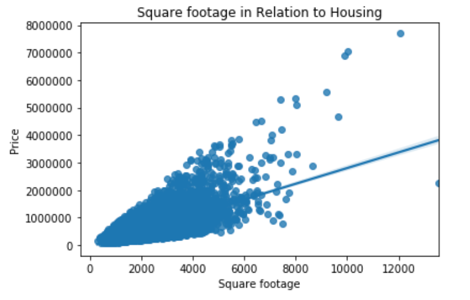

# Kings County Housing Bake-off

## Overview

For this project we were asked to build a linear regression mondel and predict how much someone would pay for a house in Kings County Seattle, Washingtion. Upon intial exploritory data analysis some of the most important predictors were zipcode,renovation,waterfron views, number of bedrooms and grade. 

## Data & Methods
