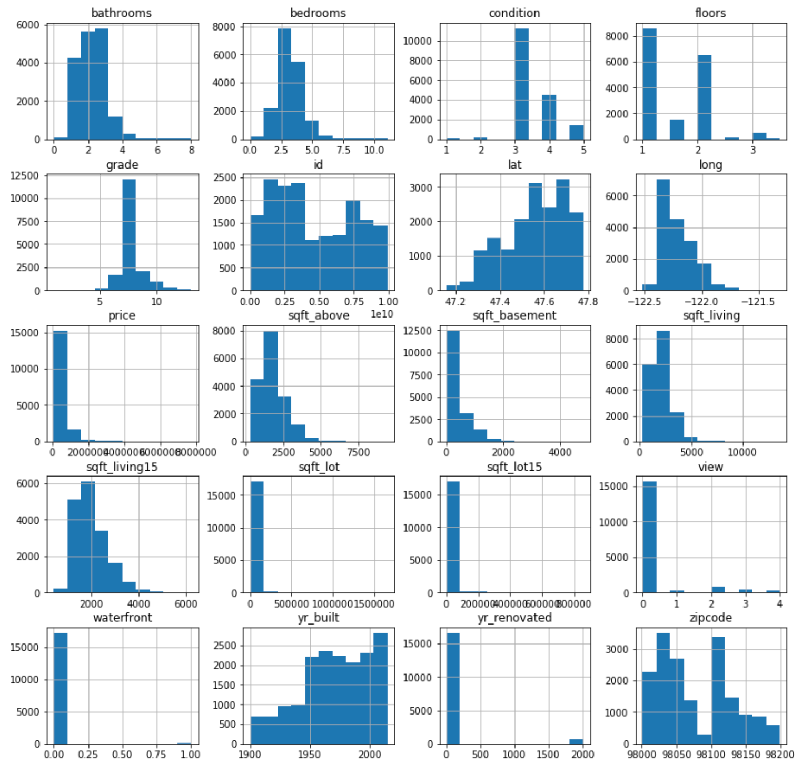

# Kings County Housing Bake-off

## Overview

For this project we were asked to build a linear regression mondel and predict how much someone would pay for a house in Kings County Seattle, Washingtion. Upon intial exploritory data analysis some of the most important predictors were zipcode,renovation,waterfron views, number of bedrooms and grade. 

Based on that discovery,I initially created features to try and make predictions based on unseen data. However, these new features actually hurt my predictive capabilities so I went with my original interaction between polinomials selected by linear regresion. The final model has an RMSE of 155714.79997127902, when predicting on testing data that was split from `kc_house_data_train.csv'. The final model's predictions on the holdout set can be found in housing_predictions_Kelvin_Arellano.csv.

## Data & Methods
This model has been developed by using the training set, `kc_house_data_train.csv`. It was then predicted on the `kc_house_data_holdout_features.csv`. The resulting dataframe with price predictions has been saved as `housing_predictions.csv`.

The overall data set contains information about **houses that were sold in King County Seattle, Washington during the last decade**. Below is a description of the column names, to help gain a better understanding about what the raw data represents. 

| column name | description |
|-|-|
| **id** | unique ID for each home |
| **date** | date the home was sold |
| **price** | selling price of each home |
| **bedrooms** | number of bedrooms |
| **bathrooms** | number of bathrooms, where .5 accounts for a room with a toilet but no shower |
| **sqft_living** | square footage of each home's interior living space |
| **sqft_lot** | square footage of each home's land space |
| **floors** | number of floors (levels) in house |
| **waterfront** | dummy varibale for whether the home is overlooking the waterfront or not |
| **view** | rating of home's view, on a scale of 0 to 4 |
| **condition** | overall condition of each home, on a scale of 1 to 5 |
| **grade** | overall grade given to each home, on a scale of 1 to 13, based on King County grading system. 1-3 falls short of building construction and design, 7 has an average level of construction and design, and 11-13 has a high quality level of construction and design |
| **sqft_above** | square footage of the interior housing space, excluding basement |
| **sqft_basement** | square footage of the basement |
| **yr_built** | year that each home was built |
| **yr_renovated** | year of each home's last renovation |
| **zipcode** | zip code in which home is located |
| **lat** | latitude coordinate |
| **long** | longitude coordinate |
| **sqft_living15** | square footage of interior housing living space for the nearest 15 neighbors |
| **sqft_lot15** | square footage of the land lots of the nearest 15 neighbors |

